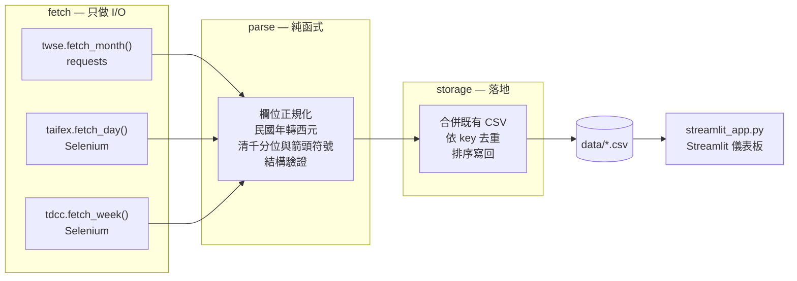

# 台股市場資料網路爬蟲與 ETL Pipeline

[](https://github.com/terencechou1022/Stock_ETL_Pipeline/actions/workflows/ci.yml)

從證交所、期交所與集保三個官方來源抽取台股資料，正規化後**冪等增量寫入** CSV。
fetch／parse／storage 三層分離，解析層為純函式，39 個測試全離線執行，
每交易日由 GitHub Actions 排程更新。

**互動儀表板**：`streamlit run streamlit_app.py`——把三個來源放在同一頁。沒有本機爬蟲結果時會自動退回版控內的 `sample_data/`，fresh clone 直接能跑。

| 來源 | 抓什麼 | 技術 |
|---|---|---|
| [臺灣證券交易所](https://www.twse.com.tw/) | 個股每日成交資訊（開高低收、成交量值） | `requests` + 官方 JSON API |
| [臺灣期貨交易所](https://www.taifex.com.tw/) | 每日行情，含**未沖銷契約量**（未平倉） | Selenium |
| [臺灣集中保管結算所](https://www.tdcc.com.tw/) | 每週股權分散表，可算出**大戶持股比例** | Selenium |

三個來源合起來才有意義：**價格**在動的時候，**期貨未平倉**告訴你有沒有新資金進場、
**大戶持股比例**告訴你籌碼是往集中還是往分散走。單看任何一個都看不出來。

---

## 工程特性

抓資料只是 Extract。這個專案真正花力氣的地方在後面幾件事：

| 特性 | 做法 | 實作位置 |
|---|---|---|
| **分層** | fetch（只做 I/O）／parse（純函式）／storage（落地）三層各司其職 | [`scrapers/`](scrapers/) |
| **冪等寫入** | 依 key 合併去重，同一區間重跑不會產生重複列 | [`storage.py`](scrapers/storage.py) |
| **增量更新** | 與既有 CSV 合併，只補新資料，排程重跑或手動補抓都不必先清檔 | [`storage.py`](scrapers/storage.py) |
| **結構驗證** | 解析前檢查欄位，不符時帶著「實際看到什麼」報錯，而不是安靜地產出髒資料 | [`errors.py`](scrapers/errors.py) |
| **部分失敗容忍** | 單日查無資料歸類為 `NoDataError`，跳過並記錄，不讓一天休市中斷整批作業 | [`taifex.py`](scrapers/taifex.py) |
| **重試策略** | 只在 fetch 層以遞增間隔重試；`NoDataError` 不重試——那是確定沒有，再試也沒用 | [`retry.py`](scrapers/retry.py) |
| **可離線測試** | parse 為純函式；測試封鎖 socket，碰到網路就失敗 | [`tests/conftest.py`](tests/conftest.py) |
| **排程執行** | GitHub Actions 每交易日收盤後自動抓取 | [`.github/workflows/`](.github/workflows/) |

其中**冪等**與**部分失敗容忍**都是實際輸出，不是設計意圖而已：

```
$ python main.py twse --stock 2330 --start 2024-02 --end 2024-03   # 與既有資料重疊
INFO    已寫入 data\twse_2330.csv：共 56 列（新增 0 列）
```

```
$ python main.py taifex --start 2024-10-02 --end 2024-10-04 --headless
INFO    暖機查詢中……
INFO    2024-10-02 無資料，略過（頁面沒有表格，應為休市日）
INFO    2024-10-03 無資料，略過（頁面沒有表格，應為休市日）
INFO    已取得 2024-10-04
INFO    已寫入 data\taifex_TX.csv：共 6 列（新增 6 列）
```

第二個例子剛好打中「假日表靠不住」這件事：2024-10-02、10-03 是颱風山陀兒的休市日，
`holidays` 套件不會收錄，所以這兩天確實會進入查詢迴圈——批次沒有中斷，而是跳過並記錄。

---

## 資料流

整份程式的核心設計是**把 I/O 與解析分開**。每個爬蟲模組都是同一組介面：



這樣拆的理由很實際：

- **`parse()` 是純函式**，餵它一份離線 HTML 或 JSON 就能測試。整套測試不需要網路、
  不需要瀏覽器，`tests/conftest.py` 甚至直接把 socket 封鎖起來，確保沒有人偷連線。
- **`fetch()` 是唯一會失敗的地方**，所以重試、等待、間隔全部集中在這一層。
- **`storage.save_csv()` 可重複執行**：同一個區間跑兩次不會產生重複列，
  排程重跑或手動補抓都不必先清檔案。

---

## 環境建置

需要 Python 3.12+ 與 Microsoft Edge（Selenium 4.6+ 內建 Selenium Manager，
會自動下載對應版本的 msedgedriver，不必手動安裝）。

```bash
python -m venv .venv
.venv\Scripts\activate
pip install -r requirements.txt
```

## 使用方式

```bash
python main.py twse   --stock 2330 --start 2024-01 --end 2024-12
python main.py taifex --start 2024-09-01 --end 2024-09-30 --contract TX --headless
python main.py tdcc   --stock 2330 --weeks 12 --headless
```

`--start` / `--end` 接受 `YYYY-MM` 或 `YYYY-MM-DD`；只給月份時，結束日會自動展開到月底。
每個子命令都有 `--help`。

實際輸出：

```
$ python main.py twse --stock 2330 --start 2024-01 --end 2024-03
20:02:47 INFO    已取得 2024-01
20:02:50 INFO    已取得 2024-02
20:02:53 INFO    已取得 2024-03
20:02:53 INFO    已寫入 data\twse_2330.csv：共 56 列（新增 56 列）
完成：data\twse_2330.csv

$ python main.py twse --stock 2330 --start 2024-02 --end 2024-03   # 重疊區間再跑一次
20:03:10 INFO    已寫入 data\twse_2330.csv：共 56 列（新增 0 列）
```

### 離開碼

排程需要區分「爬蟲壞了」與「來源當下不可用」，因此離開碼分成四種：

| 碼 | 意義 | 排程處理 |
|---|---|---|
| 0 | 成功 | — |
| 1 | 程式或來源結構壞了（API 欄位對不上、參數錯誤），需要修 | 紅燈 |
| 2 | 來源當下不可用（被擋、超時、連不上），重跑可能就好 | 綠燈 + warning |
| 3 | 查詢成功但該區間沒有資料（休市、尚未公布） | 綠燈 + warning |

分類發生在 fetch 邊界（`scrapers/retry.py`）：重試耗盡後，已經是 `ScraperError`
的原樣往上拋，其餘（連線、超時、driver 異常）才包成 `SourceUnavailableError`。
這個界線是關鍵——`UnexpectedPageError` 若被誤歸成來源問題，排程會顯示綠燈，
真正的爬蟲破壞就被吃掉了。

### 儀表板

本機執行：

```bash
streamlit run streamlit_app.py
```

顯示股價、期貨未平倉、大戶持股比例三條線。資料來源的選擇是自動的：
**有 `data/` 就用 `data/`，沒有才退回 `sample_data/`**。因為 `data/` 不納入版本控制，
fresh clone 只會有後者；本機跑過爬蟲之後就會自動切換到最新資料，不需要改任何設定。

### 資料探索 notebook

[`notebooks/eda.ipynb`](notebooks/eda.ipynb) 檢查三個來源在對齊之前長什麼樣子，
沿用儀表板同一套 `data/` → `sample_data/` 退回規則。五個問題，其中三個結論值得先知道：

- **三個來源的主鍵不同**：證交所是「日期」，期交所是「日期＋到期月份」（每天 6 支契約），
  集保是「日期＋持股級距」。所以「今天的未平倉量」不是一個數字，得先選一支契約
- **缺值有三種成因，不能用同一招處理**：`twse.註記` 整欄皆空（但除權息時是唯一線索，
  不能刪）、期交所 OHLC 的缺值全落在**遠月契約**（當天沒成交，但同一列的未平倉與結算價
  都還在——這正是儀表板看未平倉而不看期貨價格的理由）、集保 `人數` 的缺值精準對應
  `差異數調整（說明4）` 那個級距（它是股數平衡項，本來就沒有持有人）
- **三源內接之後只剩 5 個點**。`sample_data/` 這份 35 KB 快照**不足以**回答
  「價格在動的時候籌碼往哪裡走」——要回答得先跑爬蟲把 `data/` 補到涵蓋數個季度

另外三個不會報錯、只會讓數字悄悄錯掉的陷阱：`合　計` 是級距之一而且中間是**全形空白**、
`差異數調整` 是負數且**已包含在合計內**（濾掉會讓總數對不上）、
級距是字串所以直接排序會把 `"1,000,001以上"` 排在 `"1-999"` 前面。

```bash
jupyter nbconvert --execute --inplace notebooks/eda.ipynb
```

版控內的執行結果是走 `sample_data/` 的版本，與 fresh clone 及 CI 跑出來的一致。

### 報酬率分析

```bash
python analysis/returns.py --market tw --start 2023-01-01
python analysis/returns.py --market us --start 2023-01-01
```

輸出累積報酬圖與年化波動度摘要到 `analysis/output/`。

---

## 技術選擇：為什麼只有一支用 requests

這是本專案最重要的判斷，不是三支都用同一招：

**證交所有公開 JSON API**（`STOCK_DAY`），一次回傳一整個月的日成交資料。
能打 API 就不該開瀏覽器——快上兩個數量級、不依賴 DOM 結構、網站改版也不會壞。

**期交所與集保沒有公開 API**，查詢條件必須透過表單送出，而且：

- 期交所的「交易時段」選項是 **JavaScript 依查詢日期動態產生**的，
  切換時段還會以 AJAX 重建契約清單；
- 集保的週別下拉選單同樣需要送出表單才能取得該週資料。

這兩個情境沒有瀏覽器就做不到，所以保留 Selenium。**技術選擇應該由來源決定，
而不是先挑好工具再硬套。**

---

## 重構時發現並修正的問題

這個專案原本是課堂作業的三支腳本（`git log` 保留了原始版本）。重構過程中發現的問題，
大多不是風格問題，而是**會拿到錯資料或直接跑不起來**：

| 問題 | 影響 | 怎麼修 |
|---|---|---|
| `pd.date_range(..., freq='M')` | pandas 3.0 已**移除** `'M'`，直接 `ValueError`，程式完全跑不起來 | 改用 `freq='MS'` |
| `pd.read_html(web.page_source)` | pandas 3.0 把字面 HTML 當成檔案路徑，`FileNotFoundError` | 包 `StringIO`，並固定 `flavor='lxml'` |
| `select_by_index(19)` 選契約 | 該索引其實是**英鎊兌美元期貨（XBF）**，不是臺股期貨——整份資料與專案主題無關 | 改用契約代碼 `select_by_value('TX')` |
| `select_by_index(0)` 選交易時段 | 選項由 JS 依日期產生，頁面剛載入時只有「盤後交易時段」，索引 0 選到的是**盤後**而非一般時段 | 用 `value` 定位，並先做一次暖機查詢讓選項出現 |
| 查無資料的月份 | 證交所回應只有 `stat` 與 `total`，沒有 `data` 鍵，`data['data']` 直接 `KeyError` | 先檢查 `stat`，並拋出可被上層跳過的 `NoDataError` |
| `time.sleep(5)` 等頁面 | 網路慢時抓到上一頁的資料，網路快時白等 | 以「舊 `<body>` 變成 stale + `readyState` 完成」判斷導航 |
| 絕對 XPath `//*[@id="form1"]/table/tbody/tr[4]/td/input` | 表格多一列就失效 | 改用 `input[value="查詢"]` |
| 寫死 `table[1]` | 頁面多一個表格就會安靜地拿到錯的資料 | 改用「含 `持股/單位數分級` 欄」辨識目標表格，找不到就明確報錯 |
| 只有 `print()`，沒有存檔 | 跑完什麼都沒留下 | 落地成 CSV，並支援重複執行去重 |

另外有三個是重構過程中**自己踩到、再修掉**的坑，都寫進了程式碼註解：

1. **等待條件寫錯比不等更糟。** 切換交易時段會以 AJAX 重建契約 `<select>`，
   我原本用「選項數量 > 5」當等待條件——舊清單本來就滿足，條件立刻成立，
   於是拿到即將失效的元素參照。正確信號是**等舊元素變成 stale**。
2. **不要用殘留狀態推論結果。** 休市日的結果頁會把契約選單清空；
   若沿用那個頁面查下一天，會因為「選不到契約」而把**真實交易日誤判成休市**，
   靜默漏掉資料。現在遇到空選單先重新載入表單復原，是否休市只由結果頁判定。
3. **「查無資料」有多種形式。** 實測休市日會出現三種狀況：選單為空、
   結果頁只有「查無資料」四個字、`read_html` 回傳空清單（片段檔則是拋 `ValueError`）。
   三種都必須歸類成 `NoDataError`，否則一天休市就會中斷整批作業。

---

## 測試

```bash
pytest -q      # 39 passed
```

測試全部使用 `tests/fixtures/` 的離線樣本（真實回應，僅剝除 script/style 並裁切到
解析相關的節點，且逐一驗證裁切前後解析結果完全一致）。`conftest.py` 會封鎖 socket，
所以測試碰到網路就會失敗——這是「fetch 與 parse 分離」的驗證方式。

樣本包含一份**真實休市日**頁面（2024-02-28 和平紀念日），用來確保無資料的路徑
真的被處理過，而不是憑想像。

---

## 已知限制

誠實說明比假裝穩定有用：

- **DOM 依賴無法用測試保護。** 期交所與集保只要改版，`fetch` 層就會壞，
  離線樣本測不到這件事。程式的做法是**在解析前驗證欄位**，
  不符時拋出帶著「實際看到什麼」的錯誤，而不是安靜地產出錯誤資料。
- **休市日判斷不完全靠假日表。** `holidays` 套件不含颱風假、補行上班日，
  期交所也有自己的特殊休市。所以假日表只用來粗篩，真正的判斷是
  「查無資料就跳過並記錄」——以來源回傳的結果為準。
- **證交所有流量限制**，逐月請求之間固定間隔 3 秒，抓一整年約需 35 秒。
- **CI 只跑證交所那支**。兩支 Selenium 爬蟲需要瀏覽器，在 CI 上既慢又容易
  因為網站狀態而不穩定。CI 綠燈代表解析邏輯正確，**不代表來源網站沒改版**。

---

## 專案結構

```
├── main.py                  # CLI 入口
├── streamlit_app.py         # Streamlit 儀表板
├── notebooks/eda.ipynb      # 三來源的資料探索（對齊前的粒度、陷阱與缺值）
├── sample_data/             # 展示快照，供線上 demo（data/ 不納入版控）
├── scrapers/
│   ├── twse.py              # 證交所（requests + JSON API）
│   ├── taifex.py            # 期交所（Selenium）
│   ├── tdcc.py              # 集保（Selenium）
│   ├── browser.py           # Edge driver 與導航等待
│   ├── storage.py           # CSV 合併去重
│   ├── clean.py             # 民國年、千分位、箭頭符號
│   ├── retry.py             # fetch 層重試
│   └── errors.py            # NoDataError / UnexpectedPageError
├── analysis/returns.py      # 多標的累積報酬比較
├── tests/                   # 39 個離線測試 + 真實回應樣本
└── .github/workflows/       # CI（測試）與每日排程抓取
```

---

## 資料來源與聲明

資料來自臺灣證券交易所、臺灣期貨交易所、臺灣集中保管結算所之公開資訊。
本專案僅供學習與技術研究，**不構成任何投資建議**。
抓取結果（`data/`）不納入版本控制，請自行執行取得。`sample_data/` 是一份約 35 KB 的
小型快照，納入版控是為了讓 fresh clone 的儀表板與 notebook 有東西可跑。
